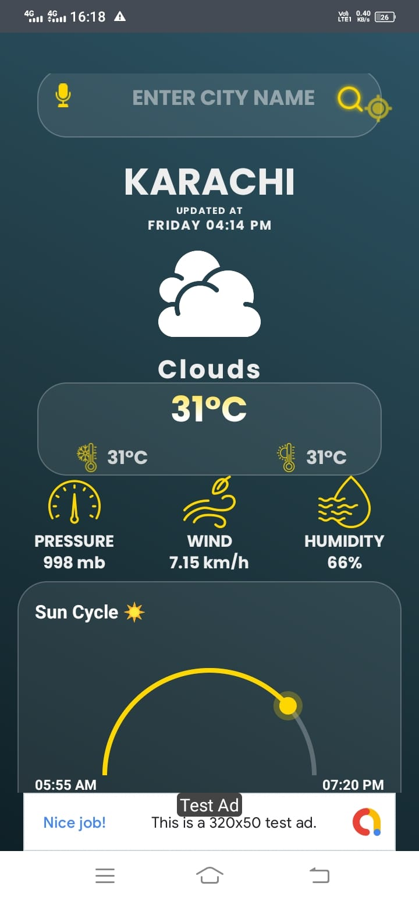

# Weather App 🌧️🌧️


## Preview


https://github.com/user-attachments/assets/f9a00e28-81ed-48fb-9031-235d65a54f53


## Screenshots
a
<p float="left">
    
    
    

</p>


#### Simple and Beautiful Weather App using Java.

I am using **https://openweathermap.org/** to get all the data using JSON file.

### Steps :

> First, you have to create a account on it.

> Then, generate a a unique API key to get all the data from the JSON file.

> Paste you **API KEY** in **_LocationCord.java_** file as

```
public final static String API_KEY = "YOUR_API_KEY_HERE";
```

<br/>

#### API key calling from this website : **https://openweathermap.org/api/one-call-3**

#### The One Call API provides the following weather data for any geographical coordinates:

- Current weather
- Minute forecast for 1 hour
- Hourly forecast for 48 hours
- Daily forecast for 8 days
- National weather alerts
- Historical weather data for 40+ years back (since January 1, 1979)

##### Note :

> Single API key on have

## Contributing

Please fork this repository and contribute back. Any contributions, large or small, major or minor features, bug fixes, are welcomed and appreciated but will be thoroughly reviewed.

